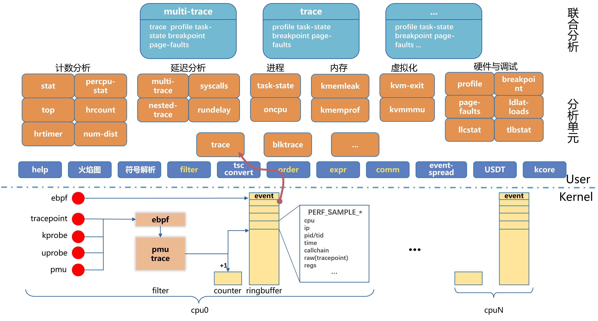

# 基于perf的监控框架

基于`libperf`和`libtraceevent`库实现简单的监控框架，提供比perf更灵活的特性。

- 数据不落盘。
- 数据过滤，基于tracepoint的过滤机制，减少数据量。
- 数据实时处理并输出。不需要存盘后再处理。
- 基于perf_event_open系统调用。

虽然比perf更灵活，但不能替代perf。perf灵活的符号处理，支持大量的event，支持很多硬件PMU特性。



## 1 框架介绍

```
# ./perf-prof  --help
Usage: perf-prof [OPTION...] profiler [PROFILER OPTION...] [help]
  or:  perf-prof [OPTION...] --symbols /path/to/bin

Profiling based on perf_event

Most Used Profilers:
  perf-prof trace -e EVENT[...] [--overwrite] [-g [--flame-graph file [-i INT]]]
  perf-prof task-state [-S] [-D] [--than ns] [--filter comm] [-g [--flame-graph file]]
  perf-prof kvm-exit [--perins] [--than ns] [--heatmap file]
  perf-prof mpdelay -e EVENT[...] [--perins] [--than ns] [--heatmap file]
  perf-prof multi-trace -e EVENT [-e ...] [-k str] [--impl impl] [--than ns] [--detail] [--perins] [--heatmap file]
  perf-prof kmemleak --alloc EVENT[...] --free EVENT[...] [-g [--flame-graph file]] [-v]
  perf-prof kmemprof -e EVENT [-e ...] [-k str]
  perf-prof syscalls -e raw_syscalls:sys_enter -e raw_syscalls:sys_exit [-k common_pid] [--than ns] [--perins] [--heatmap file]
  perf-prof hrtimer [-e EVENT[...]] [-F freq] [--period ns] [-g] [--precise] [-v]
  perf-prof percpu-stat [--syscalls]
  perf-prof top -e EVENT[...] [-i INT] [-v]
  perf-prof stat -e EVENT[...] [--perins]
  perf-prof blktrace -d device [--than ns]
  perf-prof profile [-F freq] [-g [--flame-graph file [-i INT]]] [--exclude-*] [-G] [--than PCT]
  perf-prof cpu-util [--exclude-*] [-G]
  perf-prof ldlat-loads [--ldlat cycles] [-T trigger]
  perf-prof ldlat-stores [-T trigger]
Use Fewer Profilers:
  perf-prof split-lock [-T trigger] [-G] [--test]
  perf-prof irq-off [--than ns] [-g] [--precise]
  perf-prof signal [--filter comm] [-g]
  perf-prof watchdog [-F freq] [-g]
  perf-prof llcstat
  perf-prof sched-migrate [--detail] [--filter filter] [-g [--flame-graph file]] [-v]
  perf-prof oncpu -p PID [--detail] [--filter filter]
  perf-prof page-faults [-g]

Event selector. use 'perf list tracepoint' to list available tp events.
  EVENT,EVENT,...
  EVENT: sys:name[/filter/ATTR/ATTR/.../]
  filter: ftrace filter
  ATTR:
      stack: sample_type PERF_SAMPLE_CALLCHAIN
      max-stack=int : sample_max_stack
      alias=str: event alias
      top-by=field: add to top, sort by this field
      top-add=field: add to top
      ptr=field: kmemleak, ptr field, Dflt: ptr=ptr
      size=field: kmemleak, size field, Dflt: size=bytes_alloc
      delay=field: mpdelay, delay field
      key=field: multi-trace, key for two-event
      untraced: multi-trace, auxiliary, no two-event analysis

 OPTION:
  -C, --cpu=CPU[-CPU],...    Monitor the specified CPU, Dflt: all cpu
  -i, --interval=ms          Interval, Unit: ms
  -m, --mmap-pages=pages     Number of mmap data pages and AUX area tracing mmap pages
      --order                Order events by timestamp.
      --order-mem=Bytes      Maximum memory used by ordering events. Unit: GB/MB/KB/*B.
  -p, --pids=PID,...         Attach to processes
  -t, --tids=TID,...         Attach to thread
  -v, --verbose              Verbose debug output

 PROFILER OPTION:
      --alloc=EVENT,...      Memory alloc tracepoint/kprobe
      --detail               More detailed information output
  -d, --device=device        Block device, /dev/sdx
  -D, --uninterruptible      TASK_UNINTERRUPTIBLE
  -e, --event=EVENT,...      Event selector
      --exclude-guest        exclude guest
      --exclude-kernel       exclude kernel
      --exclude-user         exclude user
      --filter=filter        Event filter/comm filter
      --flame-graph=file     Specify the folded stack file.
      --free=EVENT,...       Memory free tracepoint/kprobe
  -F, --freq=n               Profile at this frequency, Dflt: 100, No profile: 0
  -g, --call-graph           Enable call-graph recording
  -G, --guest                Monitor GUEST, Dflt: false
      --heatmap=file         Specify the output latency file.
      --impl=impl            Implementation of two-event analysis class. Dflt: delay.
                                 delay: latency distribution between two events
                                 pair: determine if two events are paired
                                 kmemprof: profile memory allocated and freed bytes
                                 syscalls: syscall delay
  -k, --key=str              Key for series events
      --ldlat=cycles         mem-loads latency, Unit: cycles
  -L, --latency=LAT          Interrupt off latency, Unit: us, Dflt: 20ms
      --overwrite            use overwrite mode
      --perins               Print per instance stat
      --period=ns            Sample period, Unit: s/ms/us/*ns
      --precise              Generate precise interrupt
      --symbols=symbols      Maps addresses to symbol names.
                             Similar to pprof --symbols.
      --syscalls             Trace syscalls
  -S, --interruptible        TASK_INTERRUPTIBLE
      --test                 Split-lock test verification
      --than=ns              Greater than specified time, Unit: s/ms/us/*ns/percent
  -T, --trigger=T            Trigger Threshold, Dflt: 1000, No trigger: 0

  -?, --help                 Give this help list
      --usage                Give a short usage message
  -V, --version              Version info

Mandatory or optional arguments to long options are also mandatory or optional for any corresponding short options.
```

监控框架采用模块化设计，目前支持一些基础的监控模块：

- split-lock，监控硬件pmu，发生split-lock的次数，以及触发情况。
- irq-off，监控中断关闭的情况。
- profile，分析采样栈，可以分析内核态CPU利用率超过一定百分比抓取内核态栈。
- cpu-util，cpu利用率监控，可以监控到guest模式的CPU利用率。派生自profile。
- trace，读取某个tracepoint事件。
- signal，监控给特定进程发送的信号。
- task-state，监控进程处于D、S状态的时间，超过指定时间可以打印栈。
- watchdog，监控hard、soft lockup的情况，在将要发生时，预先打印出内核栈。
- kmemleak，监控alloc、free的情况，判断可能的内存泄露。
- kvm-exit，监控虚拟化指令的延迟。

每个监控模块都需要定义一个`struct monitor `结构，来指定如何初始化、过滤、释放监控事件，以及如何处理采样到的监控事件。

## 2 Example: signal

一个最简单demo例子。

```
struct monitor monitor_signal = {
    .name = "signal",
    .pages = 2,
    .init = signal_init,
    .filter = signal_filter,
    .deinit = signal_exit,
    .sample = signal_sample,
};
ONITOR_REGISTER(monitor_signal)
```

定义模块初始化、过滤、销毁、处理采样等接口。

## 3 monitor.init

```
static int signal_init(struct perf_evlist *evlist, struct env *env)
{
    struct perf_event_attr attr = {
        .type          = PERF_TYPE_TRACEPOINT,
        .config        = 0,
        .size          = sizeof(struct perf_event_attr),
        .sample_period = 1,
        .sample_type   = PERF_SAMPLE_TID | PERF_SAMPLE_TIME | PERF_SAMPLE_CPU | PERF_SAMPLE_RAW |
                         (env->callchain ? PERF_SAMPLE_CALLCHAIN : 0),
        .read_format   = 0,
        .pinned        = 1,
        .disabled      = 1,
        .exclude_callchain_user = 1,
        .wakeup_events = 1, //1个事件
    };
    struct perf_evsel *evsel;
    int id;

    if (monitor_ctx_init(env) < 0)
        return -1;

    id = tep__event_id("signal", "signal_generate");
    if (id < 0)
        return -1;

    attr.config = id;
    evsel = perf_evsel__new(&attr);
    if (!evsel) {
        return -1;
    }
    perf_evlist__add(evlist, evsel);
    return 0;
}
```

定义perf_event_attr表示监控的事件。

tep__event_id("signal", "signal_generate")，获取signal:signal_generate tracepoint点的id。

perf_evsel__new(&attr)，根据perf事件，创建evsel。1个evsel表示一个特点的事件，拿着这个事件可以到对应的cpu、线程上创建出perf_event。

perf_evlist__add(evlist, evsel)，加到evlist。一个evlist表示一组evsel事件。

### 3.1 perf_event_attr

定义event的属性。可以指定perf命令定义的所有事件。

- 硬件pmu事件
  - breakpoint事件
  - cpu事件
  - uncore事件
- tracepoint点事件
- kprobe事件
- uprobe事件

可以通过`ls /sys/bus/event_source/devices`命令看到所有的事件类型。

- **perf_event_attr.type** 事件类型

  ```
  PERF_TYPE_*
  	通过`cat /sys/bus/event_source/devices/*/type`获取类型。
  ```

- **perf_event_attr.config** 事件配置

  ```
  根据不同的type, config值不一样。
  	PERF_TYPE_TRACEPOINT: config 指定tracepoint点的id.
  	PERF_TYPE_HARDWARE: config 指定特定的参数PERF_COUNT_HW_*
  ```

- **perf_event_attr.sample_period** 采样周期

  ```
  定义采样周期, 发生多少次事件之后, 发起1个event到ring buffer
  ```

- **perf_event_attr.sample_type** 采样类型

  ```
  PERF_SAMPLE_*
  	定义放到ring buffer的事件, 需要哪些字段
  ```

- **perf_event_attr.comm**

  ```
  PERF_RECORD_COMM
  	记录进程comm和pid/tid的对应关系, 可以用于libtraceevent模块中tep_register_comm,
  	之后tep_print_event(ctx.tep, &s, &record, "%s", TEP_PRINT_COMM)就能打印出进程名
  	这样只能收集新创建进程的名字, 已启动进程的pid使用/proc/pid/comm来获取.
  ```

- **perf_event_attr.task**

  ```
  PERF_RECORD_FORK/PERF_RECORD_EXIT
  	记录进程创建和退出事件
  ```

- **perf_event_attr.context_switch**

  ```
  PERF_RECORD_SWITCH/PERF_RECORD_SWITCH_CPU_WIDE
  	记录进程切换信息
  ```

## 4 monitor.sample

```
static void signal_sample(union perf_event *event)
{
    // in linux/perf_event.h
    // PERF_SAMPLE_TID | PERF_SAMPLE_TIME | PERF_SAMPLE_CPU | PERF_SAMPLE_RAW
    struct sample_type_data {
        struct {
            __u32    pid;
            __u32    tid;
        }    tid_entry;
        __u64   time;
        struct {
            __u32    cpu;
            __u32    reserved;
        }    cpu_entry;
        struct {
            __u32   size;
	        __u8    data[0];
        } raw;
    } *data = (void *)event->sample.array;

    tep__update_comm(NULL, data->tid_entry.tid);
    print_time(stdout);
    tep__print_event(data->time/1000, data->cpu_entry.cpu, data->raw.data, data->raw.size);
}
```

根据`perf_event_attr.sample_type`来定义采样的事件的字段，可以还原出一个结构体。

tep__print_event，打印tracepoint事件。

## 5 其他功能

### 5.1 模块化

每个profiler都是独立的模块文件，可扩展，可裁减，损耗低。适合高性能监控场景。

### 5.2 栈

  - 栈及符号打印。可控制内核态、用户态、地址、符号、偏移量、dso、正向栈、反向栈，每个栈帧的分隔符、栈的分隔符。
  - 支持解析内核符号(/proc/kallsyms)，用户态符号(.symtab/.dynsym)、MiniDebugInfo解析(.gnu_debugdata)。
  - 支持debuginfo包。/usr/lib/debug/.build-id/
  - key-value栈。以栈做为key，可以过滤重复栈，并能唯一寻址value。
  - 生成火焰图折叠栈格式。

### 5.3 用户态符号表

用户态符号表，使用`syms_cache`结构表示，通过pid找到特定于进程的`syms`符号集合。

syms符号集合由/proc/pid/maps内所有的文件映射组成，每一个文件映射由一个`dso`来表示，syms包含dso的集合。

每个dso由映射到进程地址空间内的[起始地址、结束地址、文件对象]表示。文件对象由`object`结构表示。

object结构表示一个动态库的符号集合，由多个`sym`组成。object是可以给多个进程共享的，通过引用计数管理object的引用和释放。

sym表示一个特定的符号。由符号名字，起始地址，大小组成。

```
syms_cache --> syms --> dso --> object --> sym
```

### 5.4 用户态内存泄露检测

```
LD_PRELOAD=/lib64/libtcmalloc.so HEAPCHECK=draconian PPROF_PATH=./perf-prof /path/to/bin
```

利用tcmalloc的内存泄露检测功能。

- **LD_PRELOAD=**，预先加载tcmalloc库，替换glibc库的malloc和free函数。
- **HEAPCHECK=**，内存泄露检测。draconian检测所有的内存泄露。
- **PPROF_PATH=**，指定符号解析命令。`perf-prof --symbols`具备跟`pprof --symbols`一样的符号解析能力。

### 5.5 栈的处理

栈的处理方式各种各样，如perf top风格的栈负载处理，火焰图风格的栈处理。

perf-prof目前支持的栈处理。

- 栈及符号打印。用`callchain_ctx`表示，定义了栈的打印风格，可控制内核态、用户态、地址、符号、偏移量、dso、正向栈、反向栈。每个栈帧的分隔符、栈的分隔符。
- key-value栈。以栈做为key，可以过滤重复栈，并能唯一寻址value。用`key_value_paires`结构表示，一般相同的栈都有类似的作用，如内存分配栈，可以分析相同的栈分配的总内存量，未释放的总内存量。类似于gperftools提供的HEAPCHECKE功能，最后报告的内存泄露是以栈为基准的。
- 火焰图。把相同的栈以及栈的每一帧聚合到一起。用`flame_graph`结构表示，能够生成折叠栈格式：反向栈、每帧以";"分隔、末尾是栈的数量。例子：`swapper;start_kernel;rest_init;cpu_idle;default_idle;native_safe_halt 1`。使用[flamegraph.pl](https://github.com/brendangregg/FlameGraph/blob/master/flamegraph.pl)生成火焰图。

### 5.6 火焰图

perf-prof仅输出折叠栈格式，并对输出栈比较多的模块做了支持。目前已支持：`profile, task-state, kmemleak, trace`

原先在stdout直接输出栈，目前切换成火焰图之后，不会再输出栈，而是会在命令结束时输出火焰图折叠栈文件。通过`[-g [--flame-graph file]]`参数启用火焰图，必须支持栈(-g)才能输出火焰图。折叠栈文件以`file.folded`命名。使用`flamegraph.pl`最终生成svg火焰图。

```
$ perf-prof task-state -S --than 100 --filter cat -g --flame-graph cat
$ flamegraph.pl cat.folded > cat.svg
```

#### 5.6.1 按时间的火焰图

是以固定间隔输出折叠栈，折叠栈包含时间戳。最终生成的火焰图是按时间排序的。对于长时间的监控，可以根据时间戳查找问题。

```
$ grep "15:46:33" cat.folded | flamegraph.pl > cat.svg #生成15:46:33秒开始的火焰图
```

#### 5.6.2 网络丢包火焰图

```
$ perf-prof trace -e skb:kfree_skb -g --flame-graph kfree_skb -m 128 #监控丢包
$ perf-prof trace -e skb:kfree_skb -g --flame-graph kfree_skb -i 600000 -m 128 #每600秒间隔输出火焰图
$ flamegraph.pl --reverse  kfree_skb.folded > kfree_skb.svg #生成火焰图
```

#### 5.6.3 CPU性能火焰图

```
$ perf-prof profile -F 1000 -C 0,1 --exclude-user -g --flame-graph profile #采样内核态CPU利用率的火焰图
$ perf-prof profile -F 1000 -C 0,1 --exclude-user -g --flame-graph profile -i 600000 #每600秒间隔输出火焰图
$ grep "15:46:33" profile.folded | flamegraph.pl > profile.svg #生成15:46:33秒开始600秒的火焰图
```

### 5.7 延迟处理

perf-prof目前支持的延迟处理。

- 统计延迟。最大延迟，最小延迟，平均延迟。
- 直方图。log2和linear直方图，使用`print_log2_hist`和`print_linear_hist`函数打印。
- 热图。横坐标是时间轴，纵坐标是延迟信息。目前支持：`kvm-exit, mpdelay, multi-trace`

### 5.8 热图

```
$ perf-prof mpdelay -e "kvm:kvm_exit,kvm:kvm_entry" -C 1 --heatmap mpdelay
$ trace2heatmap.pl --unitstime=ns --unitslabel=ns --grid mpdelay-kvm_exit-kvm_entry.lat > mpdelay-kvm_exit-kvm_entry.svg
```


