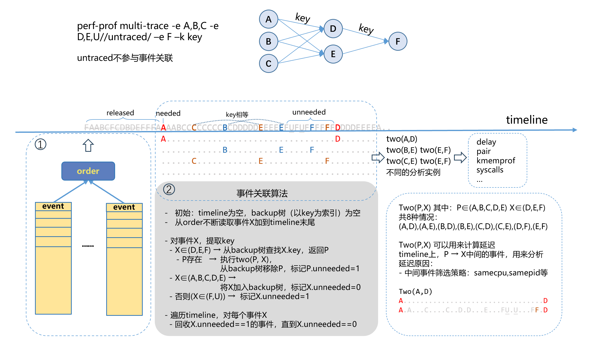
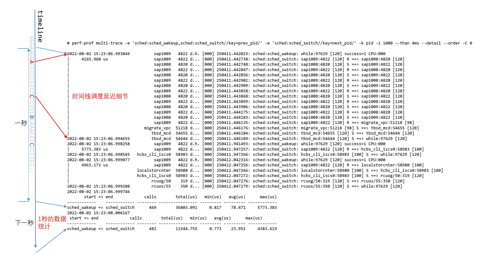

# multi-trace

```
perf-prof multi-trace -e EVENT [-e ...] [-k str] [--impl impl] [--than ns] [--detail] [--perins] [--heatmap file]

Event selector. use 'perf list tracepoint' to list available tp events.
  EVENT,EVENT,...
  EVENT: sys:name[/filter/ATTR/ATTR/.../]
  filter: ftrace filter
  ATTR:
      stack: sample_type PERF_SAMPLE_CALLCHAIN
      delay=field: mpdelay, delay field
      key=field: multi-trace, key for two-event
      untraced: multi-trace, auxiliary, no two-event analysis

OPTION:
  -C, --cpu=CPU[-CPU],...    Monitor the specified CPU, Dflt: all cpu
  -i, --interval=ms          Interval, Unit: ms
  -m, --mmap-pages=pages     Number of mmap data pages and AUX area tracing mmap pages
      --order                Order events by timestamp.
      --order-mem=Bytes      Maximum memory used by ordering events. Unit: GB/MB/KB/*B.
  -p, --pids=PID,...         Attach to processes
  -t, --tids=TID,...         Attach to thread
  -v, --verbose              Verbose debug output

PROFILER OPTION:
  -k, --key=str              Key for series events
      --impl=impl            Implementation of two-event analysis class. Dflt: delay.
                                 delay: latency distribution between two events
                                 pair: determine if two events are paired
                                 kmemprof: profile memory allocated and freed bytes
                                 syscalls: syscall delay
      --than=ns              Greater than specified time, Unit: s/ms/us/*ns/percent
      --detail               More detailed information output
      --perins               Print per instance stat
      --heatmap=file         Specify the output latency file.
```

这是一个多功能的profiler，基于事件关系，可以分析事件延迟（delay），事件是否成对（pair），内存分配和释放（kmemprof），系统调用延迟（syscalls）。

- **-e EVENT**，指定一组事件，需要指定至少2组，才能够分析延迟。
- **-k**，通过key把2个事件关联起来。
- **--impl**，2个事件的分析方法。
- **--than**，对于delay分析来说，可以打印超过指定延迟的详细信息。
- **--detail**，对于delay分析来说，配合--than参数使用，可以打印更多详细的信息。
- **--perins**，打印每个实例的统计信息。一般是以-k指定的键值作为实例。
- **--heatmap**，delay分析，延迟输出到热图文件。由python工具进一步分析。


## 原理

multi-trace分析多个事件之间的关系，并把多个事件转换成2个事件的关系，并最终统计2个事件的关联信息。

事件，可以是静态的tracepoint点，也可以是通过kprobe动态增加的tracepoint点。最少需要定义2组事件。



以`perf-prof multi-trace -e A,B,C -e D,E –e F –k key`为例，是要分析事件`A,B,C`到事件`D,E`，再到事件`F`的关系。转换成2个事件的关系：

```
- A->D，A->E
- B->D，B->E
- C->D，C->E
- D->F
- E->F
```

`A,B,C`为**起点**的3个可能性。`D,E`为**中间点**的2种可能性。`F`为**终点**。`A,B,C -> D,E -> F`必须满足*因果关系*，才能测量。`A,B,C`必须要在`D,E`之前发生，`D,E`必须要在`F`之前发生。

- **timeline链表**，所有的事件分散在各个CPU上的，在单个CPU上是按照时间顺序生成的。但所有CPU的事件合并起来，不是按照时间排序的。需要借助红黑树把事件排序后存放到timeline链表上，恢复因果关系，才能进一步处理。
- **backup红黑树**，起点事件需要等中间点事件到了之后才能处理，因此需要先备份。中间点时间需要等终点事件到了之后才能处理，也需要备份。备份到backup红黑树上。按key的值来索引。

每向timeline存放一个事件，都需要及时处理。

1. 起点事件、中间点事件、终点事件，全部先存放到timeline上。

2. 中间点事件和终点事件，需要先获取key的值，并根据key从backup红黑树查找前一级的事件。如果找到，就转换成2个事件来分析。处理完成后，前一级的事件就不需要了，在timeline上标记为**unneeded**，等待释放。

3. 起点事件和中间点事件，备份到backup红黑树上，等待后一级的处理。

4. 终点事件，本身就是不需要的，直接在timeline上标记为**unneeded**，等待释放。

5. 如果有事件被标记为**unneeded**，按照时间顺序扫描timeline，释放标记为**unneeded**的事件，直到标记为needed的事件为止。

2个事件的分析方法。

- **delay**，统计2个事件的延迟，如图，`two(A,D)`，dist <<< timeD-timeA，延迟超过阈值，打印事件[A,D]，如果有--detail参数打印[A-D]。
- **syscalls**，统计系统调用的延迟，按照系统调用号来分类。延迟超过阈值，打印事件[A,D]。仅适用用系统调用事件`-e raw_syscalls:sys_enter -e raw_syscalls:sys_exit`。
- **pair**，统计成对事件的数量。
- **kmemprof**，统计内存分配和释放的次数及字节数。打印内存分配最多的前10个调用栈。仅适用于内存分配和释放事件。


实际有一些应用场景。

- 调度延迟，分析的是`sched:sched_wakeup,sched:sched_switch/prev_state==0/key=prev_pid/`到`sched:sched_switch//key=next_pid/`的延迟。进程被唤醒，到进程切换到cpu上执行。进程Running状态切出去，到进程再次切换到cpu上执行。起点事件存在2种可能性。

- 内存分配，分析的是`malloc,calloc`到`free`之间的关系。起点事件存在2种可能性。

实际的场景还有很多，如系统调用从进入到退出，中间可能会经过很多点。虚拟机vmexit到vmentry，中间会经过很多点。收包中断，到包走完协议栈的路径。


### 性能考虑

减少工具的CPU占用率，降低对业务的干扰。

- **--detail参数**，不需要中间细节时可以不加--detail参数。因此，可以不需要向timeline备份事件，把事件直接备份到**backup红黑树**上，unneeded的事件可以直接释放。
- **因果关系**，如果所有事件`A,B,C,D,E,F`都在同一个CPU上发生，就会天然的满足因果关系，可以配合-C参数只选择一个CPU。如果不能确定都在同一个CPU上发生，需要选中所有CPU，并且使用--order参数来排序。
- **-k参数**，根据事件`A,B,C -> D,E -> F`的关联关系，如果是按照CPU关联起来的，不加-k参数。如，软中断在一个CPU上发生必须在同一个CPU上结束，就是以CPU作为key。


## 示例

调度延迟示例，统计调度延迟，并打印调度延迟超过4ms的中间事件。



时间线上`two(A,C)`调度延迟超过4ms，通过--detail参数，打印出[A-C]的全部中间事件，可以辅助分析。


通过`untraced`属性，可以加更多的中间事件来辅助分析。

```
perf-prof multi-trace -e 'sched:sched_wakeup,sched:sched_switch//key=prev_pid/' -e 'sched:sched_switch//key=next_pid/,sched:sched_stat_runtime//untraced/' -k pid -i 1000 --than 4ms --detail --order -C 0
```


通过`filter`可以过滤不需要的事件，减少事件可以降低cpu占用率。

```
perf-prof multi-trace -e 'sched:sched_wakeup/comm~"while*"/,sched:sched_switch/prev_comm~"while*"/key=prev_pid/' -e 'sched:sched_switch//key=next_pid/,sched:sched_stat_runtime//untraced/' -k pid  -m 32 -i 1000 --than 4ms --detail --order -C 0
```


不需要中间事件时，可以去掉--detail参数，提升性能。